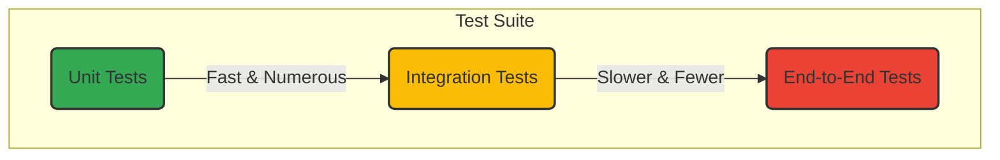

# Testing Guidelines and Strategy

## 1. Philosophy

Our approach to testing is pragmatic, risk-based, and focused on automation. Quality is a shared responsibility, not a separate phase. We write tests to build confidence, enable refactoring, and provide living documentation for our code. We follow a "Test-Driven Development" (TDD) approach where feasible, writing tests before or alongside the implementation.

## 2. The Testing Pyramid

We adhere to the principle of the testing pyramid to ensure a fast, reliable, and cost-effective test suite.

*   **Unit Tests (70-80% of tests):** These are the foundation. They test individual components (classes, methods, functions) in isolation. They are fast, stable, and easy to maintain.
*   **Integration Tests (15-25% of tests):** These verify that different components work together correctly. This includes interactions with databases, APIs, file systems, or other services.
*   **End-to-End (E2E) Tests (5-10% of tests):** These validate complete user journeys from the UI to the backend. They are slow and can be brittle, so they should be reserved for the most critical "happy path" scenarios.

## 3. Unit Test Guidelines

**Purpose:** To verify that a single unit of code behaves as intended.

*   **Frameworks:** Use modern, industry-standard frameworks like JUnit 5 (Java), Jest/Vitest (JavaScript/TypeScript), or PyTest (Python).
*   **Isolation:** A unit test **must not** depend on external systems like databases, networks, or the file system. Use mocks, stubs, or fakes to isolate the component under test.
*   **Structure (AAA Pattern):**
    *   **Arrange:** Set up the test data, mocks, and initial state.
    *   **Act:** Call the method or function being tested.
    *   **Assert:** Verify that the outcome is as expected.
*   **Specificity:** Each test should verify one specific behavior or outcome. A single method may have multiple tests covering different scenarios (e.g., valid input, invalid input, edge cases).
*   **Readability:** Test names should clearly describe what they are testing (e.g., `test_placeOrder_should_apply_10_percent_discount_for_orders_over_1000`).

## 4. Integration Test Guidelines

**Purpose:** To verify the interaction and data flow between multiple components.

*   **Scope:** Focus on the "seams" between components. For example:
    *   Service layer to Repository/DAO layer.
    - API endpoint to Service layer.
    *   Communication with an external API.
*   **Environment:** Use in-memory databases (like H2), test containers (e.g., Testcontainers), or a dedicated test database. Avoid using shared development databases.
*   **Data Management:** Each integration test should be responsible for its own data setup and teardown to ensure tests are independent and repeatable.
*   **Mocking:** Only mock external systems that are out of the test's scope. For example, when testing your service's interaction with a database, do not mock the database itself. However, if your service calls an external payment gateway, you would mock the gateway.

## 5. End-to-End (E2E) Test Guidelines

**Purpose:** To simulate a real user journey and verify the entire system works together.

*   **Frameworks:** Use modern E2E frameworks like Cypress, Playwright, or Selenium.
*   **Critical Paths Only:** E2E tests should be reserved for the most critical user journeys (e.g., user registration, login, core purchase flow).
*   **No Business Logic:** Do not test complex business logic in E2E tests. That should be covered by unit and integration tests.
*   **Independent of UI Details:** Tests should interact with the UI based on user-visible attributes (`data-testid`, ARIA labels) rather than brittle CSS selectors or XPath. This makes them more resilient to UI changes.
*   **Data Seeding:** Use programmatic APIs or database scripts to seed required data before an E2E test runs. Avoid relying on the UI to create test data.

## 6. General Best Practices

*   **Test Naming Conventions:**
    *   Files: `[ComponentName].test.js`, `[ClassName]Test.java`.
    *   Methods/Descriptions: `should_do_something_when_condition_is_met`.
*   **Code Coverage:** Aim for a meaningful code coverage target (e.g., 80-90%) as a guideline, but do not treat it as the ultimate measure of quality. A test suite with 100% coverage can still be poor if it has no meaningful assertions.
*   **CI/CD Integration:** All tests **must** run as part of the CI/CD pipeline on every commit. A failing build must block merges to the main branch.
*   **Non-Functional Testing:**
    *   **Performance:** Write specific performance tests for critical code paths.
    *   **Security:** Use static analysis tools (SAST) and dependency scanning in the pipeline.
*   **Bug Reproduction:** Whenever a bug is found, a new failing test that reproduces the bug should be written first. The bug is considered fixed only when this new test passes.
