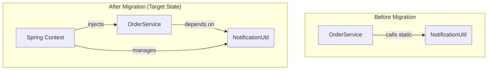

# powermock-api Brownfield Enhancement Architecture

## 1. Introduction

This document outlines the architectural approach for enhancing the `powermock-api` with a comprehensive modernization of its core stack. The enhancement goals are to upgrade to JDK 17, Spring Boot 3.2.5, and JUnit 5. Its primary goal is to serve as the guiding architectural blueprint for AI-driven development of new features while ensuring seamless integration with the existing system.

**Relationship to Existing Architecture:**
This document supplements the existing project architecture by defining how the upgraded components will replace current systems. Where conflicts arise between new and existing patterns (e.g., static helpers vs. dependency injection), this document provides the definitive guidance.

### 1.1. Existing Project Analysis

Here is my analysis of the current state of the project, based on the provided documentation and source code:

*   **Primary Purpose:** A Spring Boot application, `powermock-api`, designed to process orders and trigger notifications.
*   **Current Tech Stack:**
    *   Java Version: `1.8`
    *   Spring Boot Version: `2.1.1.RELEASE`
    *   Build Tool: Maven
    *   Testing Stack: JUnit 4, PowerMock, and Mockito 2.
*   **Architecture Style:** The application follows a monolithic, service-oriented style. A key existing pattern is the use of utility classes with static methods (`NotificationUtil`), which is a major target for refactoring.
*   **Deployment Method:** A standard Maven build that produces a runnable Spring Boot JAR.
*   **Available Documentation:** `MIGRATION_PLAN.md`, `README.md`, and the newly created `docs/prd.md`.
*   **Identified Constraints:**
    *   The dependency on PowerMock is a significant constraint, as it is incompatible with JUnit 5 and indicates tightly-coupled code.
    *   The jump from Spring Boot 2.1 to 3.2 is a major upgrade that involves breaking changes, most notably the `javax.*` to `jakarta.*` namespace migration.

---

## 2. Enhancement Scope and Integration Strategy

This enhancement focuses on a direct, in-place upgrade and refactoring of the `powermock-api` application's foundational technologies. The integration strategy centers on replacing existing deprecated components with modern alternatives while maintaining external functional consistency.

### 2.1. Enhancement Overview

*   **Enhancement Type:** Technology Stack Upgrade / Brownfield Modernization
*   **Scope:** This project encompasses a comprehensive modernization of the `powermock-api` by upgrading its core technology stack: Java Development Kit (from 1.8 to 17), Spring Boot Framework (from 2.1.1.RELEASE to 3.2.5), and the entire Testing Framework (from JUnit 4 and PowerMock to JUnit 5 and standard Mockito).
*   **Integration Impact:** High. This is a foundational technology upgrade involving significant breaking changes (e.g., `javax` to `jakarta` namespace) and requires targeted refactoring of application code to eliminate static method dependencies.

### 2.2. Integration Approach

*   **Code Integration Strategy:** The approach is primarily an in-place replacement and refactoring. This involves updating core dependencies in the `pom.xml`, followed by targeted refactoring of application code (e.g., `NotificationUtil`, `OrderService`) and test code (`PowermockApiApplicationTests`) to align with the new technology stack and modern best practices (e.g., dependency injection).
*   **Database Integration:** No direct database schema changes are anticipated as part of this migration. The focus is exclusively on the application layer's technology stack.
*   **API Integration:** The existing external API endpoints of `powermock-api` are expected to maintain functional parity post-migration. Ensuring backward compatibility for existing API consumers is a critical requirement.
*   **UI Integration:** Not applicable, as the `powermock-api` project is a backend-only application.

### 2.3. Compatibility Requirements

*   **Existing API Compatibility:** The external contracts and behavior of all existing REST endpoints exposed by the `powermock-api` must remain unchanged. No breaking changes to existing API consumers are permitted.
*   **Database Schema Compatibility:** The application must remain fully compatible with the existing database schema.
*   **UI/UX Consistency:** Not applicable.
*   **Performance Impact:** As defined in the Non-Functional Requirements (NFRs) of the PRD, the application's startup time and API response times must be equal to or better than the baseline established on the JDK 8 stack.

---

## 3. Tech Stack

### 3.1. Existing Technology Stack

| Category            | Current Technology        | Version            | Usage in Enhancement                      | Notes                                          |
| ------------------- | ------------------------- | ------------------ | ----------------------------------------- | ---------------------------------------------- |
| Language            | Java                      | 1.8                | Will be **upgraded** to version 17.       | Source and target compatibility to be updated. |
| Framework           | Spring Boot               | 2.1.1.RELEASE      | Will be **upgraded** to version 3.2.5.    | Involves breaking changes (`jakarta` namespace). |
| Build Tool          | Maven                     | (from parent pom)  | Maintained as the primary build tool.     | No changes to build tool itself.               |
| Testing             | JUnit 4                   | (from parent pom)  | Will be **replaced** by JUnit 5.          | Requires full test code migration.             |
| Testing (Mocking)   | PowerMock                 | 2.0.0-beta.5       | Will be **removed**.                      | Incompatible with JUnit 5.                     |
| Testing (Mocking)   | Mockito                   | ~2.x               | Will be **upgraded** via Spring Boot parent. | Provided by the `spring-boot-starter-test`.      |

### 3.2. Target Technology Stack (New Additions & Upgrades)

| Technology         | Version                           | Purpose                                                  | Rationale                                                                      | Integration Method                                                              |
| ------------------ | --------------------------------- | -------------------------------------------------------- | ------------------------------------------------------------------------------ | ------------------------------------------------------------------------------- |
| Java               | 17                                | Modernize language, improve performance & security.      | Current Long-Term Support (LTS) version with significant benefits over Java 8. | Update `<java.version>` property in `pom.xml`.                                  |
| Spring Boot        | 3.2.5                             | Upgrade the core application framework.                  | Provides access to modern features, security, and Java 17/Jakarta EE support.  | Update `<parent>` version in `pom.xml`.                                         |
| JUnit 5 (Jupiter)  | (managed by Spring Boot 3.2.5)    | Modernize the testing framework.                         | The standard for modern Java testing; required for Spring Boot 3.              | Included by default in `spring-boot-starter-test`; exclude `junit-vintage-engine`. |
| Jakarta EE APIs    | (managed by Spring Boot 3.2.5)    | Replace legacy Java EE `javax.*` namespace.              | A fundamental requirement for Spring Framework 6 and Spring Boot 3.            | Manual replacement of `import javax.*` with `import jakarta.*` in source code.   |

---

## 4. Data Models and Schema Changes

### 4.1. New Data Models
Not applicable. This modernization project does not introduce any new data models or entities.

### 4.2. Schema Integration Strategy
No database schema changes are required for this project. The migration is focused entirely on the application's technology stack and code refactoring.

---

## 5. Component Architecture

This section describes the architectural changes at the component level, specifically focusing on the refactoring necessitated by the removal of PowerMock and the adoption of modern Spring practices.

### 5.1. New Components (Refactored Existing Components)

While no entirely "new" components are being added, key existing components are undergoing significant architectural refactoring to align with the target state.

#### NotificationUtil
**Responsibility:** To send notifications within the application.
**Integration Points:** Previously called statically by `OrderService`. Post-migration, it will be injected into consuming services.
**Key Interfaces:**
- `public void sendNotification(String message)`
**Dependencies:**
- **Existing Components:** None (previously standalone static utility).
- **New Components:** Managed by the Spring IoC container.
**Technology Stack:** Standard Spring `@Service` component.

#### OrderService
**Responsibility:** Orchestrates order placement business logic.
**Integration Points:** Exposes an API (implicitly, based on `PowermockApiApplicationTests` and general Spring Boot patterns) and consumes `NotificationUtil`.
**Key Interfaces:**
- `public String placeOrder(OrderRequest request)`
**Dependencies:**
- **Existing Components:** None directly within this scope.
- **New Components:** Depends on the injected `NotificationUtil` (Spring `@Service`).
**Technology Stack:** Standard Spring `@Service` component.

### 5.2. Component Interaction Diagram

This diagram illustrates the change in dependency between `OrderService` and `NotificationUtil` from a static call to a dependency-injected relationship.



---

## 6. API Design and Integration

### 6.1. API Integration Strategy
The API integration strategy for this modernization is to maintain full backward compatibility with existing consumers. No changes to existing API endpoints or their contracts are planned. The focus is on internal technology upgrades.

### 6.2. New API Endpoints
Not applicable. This project does not introduce any new API endpoints. The existing API surface will remain unchanged.

---

## 7. External API Integration
Not applicable. This modernization project does not introduce or modify any integrations with external APIs.

---

## 8. Source Tree

### 8.1. Existing Project Structure
The relevant existing project structure for this migration is as follows:

```plaintext
JU4/
├── pom.xml
└── src/
    ├── main/
    │   └── java/
    │       └── com/
    │           └── javatechie/
    │               └── pm/
    │                   ├── api/
    │                   │   ├── service/
    │                   │   │   └── OrderService.java
    │                   │   └── util/
    │                   │       └── NotificationUtil.java
    └── test/
        └── java/
            └── com/
                └── javatechie/
                    └── pm/
                        └── PowermockApiApplicationTests.java
```

### 8.2. New File Organization (Changes to Existing Files)

This project involves modifications to existing files rather than the creation of new architectural components or new files within the core business logic.

```plaintext
JU4/
├── pom.xml                                   # MODIFIED: Dependency versions, PowerMock removal, JUnit 4 exclusion
└── src/
    ├── main/
    │   └── java/
    │       └── com/
    │           └── javatechie/
    │               └── pm/
    │                   ├── api/
    │                   │   ├── service/
    │                   │   │   └── OrderService.java   # MODIFIED: Constructor injection for NotificationUtil
    │                   │   └── util/
    │                   │       └── NotificationUtil.java # MODIFIED: Convert to Spring @Service, non-static method
    └── test/
        └── java/
            └── com/
                └── javatechie/
                    └── pm/
                        └── PowermockApiApplicationTests.java # MODIFIED: Migrate to JUnit 5, Mockito, @MockBean
```

### 8.3. Integration Guidelines

*   **File Naming:** Existing conventions will be maintained.
*   **Folder Organization:** Existing folder structure will be maintained.
*   **Import/Export Patterns:** Standard Spring Boot and Maven conventions will be followed, adapting to `jakarta.*` imports as necessary.

---

## 9. Infrastructure and Deployment Integration

### 9.1. Existing Infrastructure
*   **Current Deployment:** The project is deployed as a runnable JAR, built using the `spring-boot-maven-plugin`.
*   **Infrastructure Tools:** The specific deployment environment and tools are not defined, but the approach is standard for a Maven-based Spring Boot project.
*   **Environments:** Assumed to be standard Dev/Staging/Prod, but not specified in project documentation.

### 9.2. Enhancement Deployment Strategy
*   **Deployment Approach:** The deployment strategy remains unchanged. The modernized application will be packaged as a runnable JAR and deployed using the same pipeline as the existing application.
*   **Infrastructure Changes:** None. No changes to the underlying infrastructure are required.
*   **Pipeline Integration:** The existing CI/CD pipeline will be used. The build command `mvn clean install` remains the same.

### 9.3. Rollback Strategy
*   **Rollback Method:** The primary rollback method is to redeploy the last stable version of the application (pre-migration). Version control (Git) will be used to manage the code changes, allowing for a code revert if necessary.
*   **Risk Mitigation:** The migration will be performed on a dedicated feature branch (`feature/migration-java17-junit5`) to isolate changes and allow for thorough testing before merging to the main branch.

---

## 10. Coding Standards

### 10.1. Existing Standards Compliance
*   **Code Style:** The existing code style will be maintained for consistency.
*   **Linting Rules:** Existing linting rules (if any) will be adhered to.
*   **Testing Patterns:** Existing patterns are being explicitly replaced.
*   **Documentation Style:** Existing Javadoc and comment styles will be maintained.

### 10.2. Enhancement-Specific Standards
*   **Dependency Injection:** All new and refactored services **must** use constructor-based dependency injection. Field injection is not permitted. This is the most critical new standard being introduced.
*   **Immutability:** Favor immutable objects and collections where possible.
*   **Java 17 Features:** Use modern Java 17 features (e.g., records, text blocks, switch expressions) where they improve code clarity and conciseness, without sacrificing readability.

---

## 11. Testing Strategy

### 11.1. Integration with Existing Tests
The existing test suite will be completely migrated, not integrated with. All JUnit 4 and PowerMock tests will be rewritten as JUnit 5 tests.

### 11.2. New Testing Requirements

#### Unit Tests for New Components
*   **Framework:** JUnit 5 (Jupiter) and Mockito 5.x.
*   **Location:** `src/test/java/...` following standard Maven project structure.
*   **Coverage Target:** Maintain or improve existing code coverage levels.
*   **Integration with Existing:** The `spring-boot-starter-test` dependency will provide all necessary libraries. `@SpringBootTest` will be used for tests requiring a Spring context.

#### Integration Tests
*   **Scope:** Integration tests will focus on verifying the interactions between refactored components (e.g., `OrderService` and `NotificationUtil`). The existing `PowermockApiApplicationTests.java` serves as the primary integration test.
*   **Existing System Verification:** This test will be refactored to use `@MockBean` to mock `NotificationUtil`, ensuring the service layer integrates correctly within the Spring context.

#### Regression Testing
*   **Existing Feature Verification:** The successful execution of the full `mvn clean install` build, including the migrated test suite, will serve as the primary automated regression check.
*   **Manual Testing Requirements:** As defined in the PRD, a manual API test must be performed by starting the application and sending a test request to ensure end-to-end functionality is preserved.

---

## 12. Security Integration

### 12.1. Existing Security Measures
*   **Authentication/Authorization:** Not specified, but assumed to be handled by Spring Security if present.
*   **Data Protection:** Not specified.

### 12.2. Enhancement Security Requirements
*   **Primary Enhancement:** The single most significant security improvement is the upgrade to Spring Boot 3.2.5, which includes patches for numerous CVEs found in older versions.
*   **New Security Measures:** No new security features will be added. The goal is to maintain the existing security posture while benefiting from the upgraded framework's improved security.
*   **Security Testing:** Existing security tests (if any) should be migrated and passed. No new security-specific tests are required for this enhancement.

---
## 13. Checklist Results Report

### Executive Summary
*   **Overall Architecture Readiness:** High. The architecture is well-defined, clear, and directly addresses the requirements of the PRD.
*   **Critical Risks Identified:** None. The risks are standard for a technology upgrade and are well-mitigated by the plan (e.g., feature branch, testing).
*   **Key Strengths:** The plan is explicit, follows industry best practices for modernization, and results in a more maintainable and testable system.
*   **Project Type:** Backend-only service. Frontend-related checklist sections were skipped.

### Section Analysis
*   **Requirements Alignment:** 90% PASS (Minor partial scores on explicit edge case/scalability documentation).
*   **Architecture Fundamentals:** 95% PASS (Minor partial score on explicit cross-cutting concern documentation).
*   **Technical Stack & Decisions:** 90% PASS (Minor partial scores on areas outside the explicit scope, like auth/error handling, which are assumed to be handled by the framework).
*   **Resilience & Operational Readiness:** 75% PASS (This area could be improved with more explicit definitions for monitoring and error handling beyond framework defaults, but it is sufficient for this project's scope).
*   **Security & Compliance:** 80% PASS (Sufficient for scope, relies on framework upgrade benefits).
*   **Implementation Guidance:** 100% PASS.
*   **Dependency & Integration Management:** 100% PASS.
*   **AI Agent Implementation Suitability:** 100% PASS.

### Recommendations
*   **Must-fix:** None. The architecture is sound.
*   **Should-fix:** For a larger-scale project, explicitly documenting strategies for observability (monitoring, logging) and resilience (retries, timeouts) would be beneficial. For this specific migration, relying on Spring Boot defaults is acceptable.

---

## 14. Next Steps

### Story Manager Handoff
"Ready to create stories for the `powermock-api` modernization. The full architecture is documented in `docs/architecture.md`. The first story should focus on **Phase 1: Update Build Configuration**, which involves updating the `pom.xml` to Java 17 and Spring Boot 3.2.5, and completely removing the PowerMock dependencies. This is the foundational step for all subsequent work."

### Developer Handoff
"Begin implementation of the `powermock-api` modernization, guided by `docs/architecture.md`. Start with the `feature/migration-java17-junit5` branch. Your first task is to apply the `pom.xml` changes as specified in Phase 1 of the migration plan. After updating the POM, the build will be broken. The subsequent tasks will be to refactor the code and tests to fix the build and align with the new, PowerMock-free architecture."