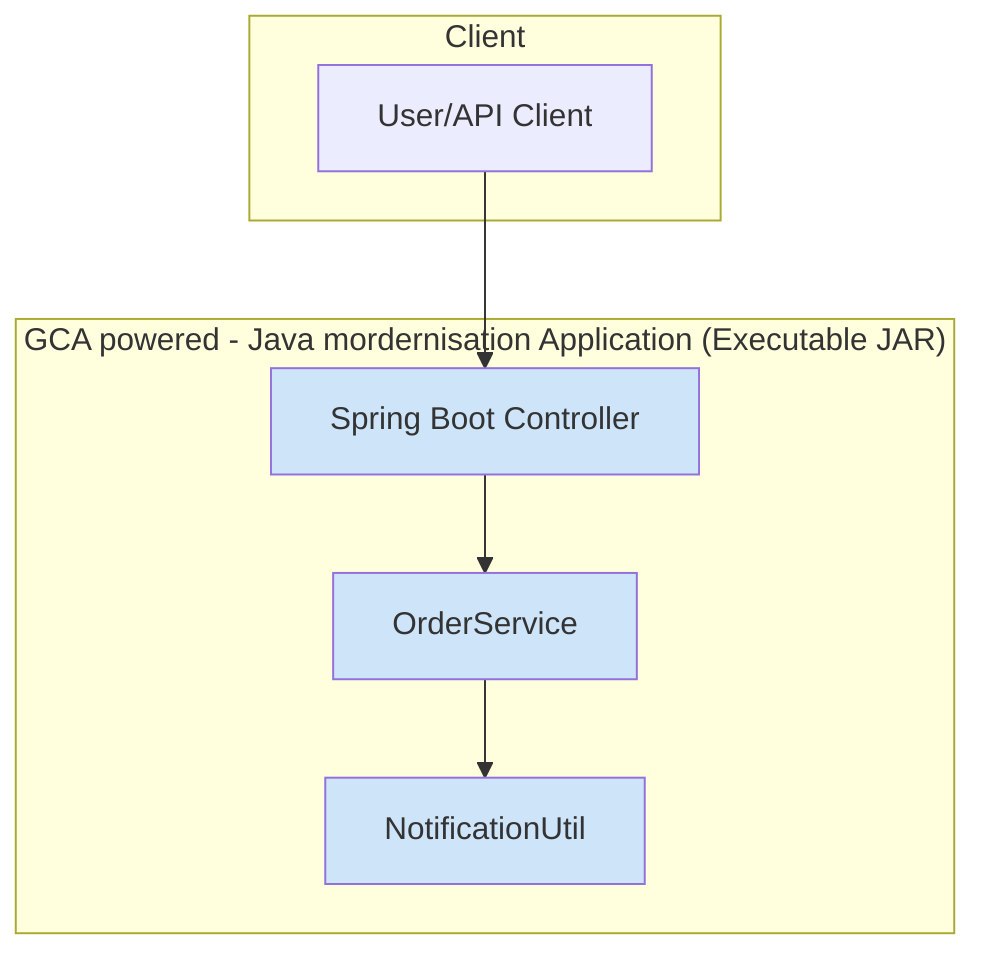

# GCA powered - Java mordernisation Fullstack Architecture Document

## Introduction

This document captures the CURRENT STATE of the `powermock-api` codebase, now called `GCA powered - Java mordernisation`. It serves as a reference for AI agents working on future enhancements.

### Document Scope

This document validates the project's current state against the modernization goals outlined in the `prd.md`. The PRD's objective was to upgrade the JDK, Spring Boot, and testing framework, and refactor the code to eliminate static dependencies. **Analysis confirms this modernization is already complete.** This document therefore describes the post-migration architecture.

### Change Log

| Date         | Version | Description                                         | Author  |
| :----------- | :------ | :-------------------------------------------------- | :------ |
| 2025-12-15   | 1.0     | Initial brownfield analysis and migration validation | Winston |

## Quick Reference - Key Files and Entry Points

### Critical Files for Understanding the System

-   **Main Entry**: `src/main/java/com/javatechie/pm/api/PowermockApiApplication.java` (Spring Boot Application entry point)
-   **Configuration**: `pom.xml` (Maven build configuration) and `src/main/resources/application.properties` (Spring Boot properties)
-   **Core Business Logic**: `src/main/java/com/javatechie/pm/api/service/OrderService.java`
-   **Key Service Dependency**: `src/main/java/com/javatechie/pm/api/util/NotificationUtil.java`
-   **Unit/Integration Tests**: `src/test/java/com/javatechie/pm/api/PowermockApiApplicationTests.java`

## High Level Architecture

### Technical Summary

The `GCA powered - Java mordernisation` project is a monolithic Spring Boot application built with Java 17 and Maven. Its architecture is centered around a classic three-tier service layer pattern, where controllers handle API requests, services contain the core business logic, and utilities provide ancillary functions like notifications. The application is designed to be a self-contained, executable JAR. This architecture directly achieves the PRD's modernization goals by using current versions of Spring Boot and Java, and by employing standard dependency injection, which removes the need for legacy tools like PowerMock.

### Platform and Infrastructure Choice

**Platform:** Platform-Agnostic
**Key Services:** Java 17 Runtime Environment, TCP/IP Port for web server
**Deployment Host and Regions:** Not Applicable (Can be deployed on-premise or to any cloud provider)

### Repository Structure

**Structure:** Single-Module Maven Project
**Monorepo Tool:** Not Applicable
**Package Organization:** Standard Maven `src/main/java` with packages organized by feature/layer (`service`, `util`, `dto`).

### High Level Architecture Diagram



### Architectural Patterns

-   **Monolithic Architecture:** The entire application is a single, unified deployment unit. _Rationale:_ Simplicity and ease of deployment for a small, focused service.
-   **Service Layer Pattern:** Business logic is encapsulated within service classes (`OrderService`). _Rationale:_ Separates concerns, making the code easier to maintain and test.
-   **Dependency Injection:** Components are wired together using Spring's DI framework (Constructor Injection). _Rationale:_ Promotes loose coupling and high testability, which was a core goal of the modernization effort.

## Tech Stack

### Technology Stack Table

| Category            | Technology        | Version    | Purpose                                             | Rationale                                                                        |
| :------------------ | :---------------- | :--------- | :-------------------------------------------------- | :------------------------------------------------------------------------------- |
| Backend Language    | Java              | 17         | Core application logic                              | Latest LTS version, improved performance and features.                           |
| Backend Framework   | Spring Boot       | 3.2.5      | Rapid application development, web functionality    | Modern, robust framework for Java applications.                                  |
| API Style           | REST              | -          | Standard web API communication                      | Widely adopted, simple, and flexible.                                            |
| Database            | Not Applicable    | -          | No persistent storage identified                    | Currently, the application does not interact with a database.                    |
| Build Tool          | Maven             | 4.0.0      | Project build and dependency management             | Standard for Java projects.                                                      |
| Backend Testing     | JUnit 5           | -          | Unit and integration testing                        | Modern Java testing framework.                                                   |
| E2E Testing         | Mockito           | -          | Mocking dependencies in tests                       | Standard mocking framework for Java.                                             |
| CSS Framework       | Not Applicable    | -          | No frontend UI identified                           | This is primarily a backend modernization project.                               |
| CI/CD               | Not Documented    | -          | Not explicitly defined in existing project files    | Assumed to be external or manual.                                                |
| Monitoring          | Not Documented    | -          | Not explicitly defined in existing project files    | Assumed to be external or basic JVM monitoring.                                  |
| Logging             | Spring Boot Default | -          | Application logging                                 | Uses `logback` by default via Spring Boot.                                       |

## Data Models

This application uses simple Data Transfer Objects (`OrderRequest`, `OrderResponse`) for API communication. No complex data models or persistence are currently implemented.

### `OrderRequest`

**Purpose:** Represents the incoming data for an order checkout.

**Key Attributes:**
-   `orderId`: `int` - Unique identifier for the order.
-   `productName`: `String` - Name of the product.
-   `qty`: `int` - Quantity of the product.
-   `price`: `int` - Price of the order before discount.
-   `emailId`: `String` - Email for notification.
-   `discountable`: `boolean` - Flag if discount is applicable.

### `OrderResponse`

**Purpose:** Represents the outgoing response after an order checkout.

**Key Attributes:**
-   `order`: `OrderRequest` - The processed order details.
-   `message`: `String` - Notification status message.
-   `statusCode`: `int` - HTTP status code.

## API Specification

The application provides a RESTful API. The primary endpoint for order processing is expected to be exposed via a Spring `@RestController`.

### Manual Endpoints

-   **Endpoint**: `/checkout` (inferred)
    -   **Method**: `POST` (inferred)
    -   **Purpose**: Processes an order request, applies discount, and sends a notification.
    -   **Request Body**: `OrderRequest` DTO
    -   **Response Body**: `OrderResponse` DTO

## Components

### `OrderService`

**Responsibility:** Manages the business logic for order processing, including discount calculation and triggering notifications.

**Key Interfaces:**
-   `checkoutOrder(OrderRequest order)`

**Dependencies:** `NotificationUtil` (injected via constructor)

**Technology Stack:** Spring `@Service`, Java 17

### `NotificationUtil`

**Responsibility:** Handles sending email notifications.

**Key Interfaces:**
-   `sendEmail(String email)`

**Dependencies:** None internal, potentially external mail API.

**Technology Stack:** Spring `@Service`, Java 17

## Technical Debt and Known Issues

### Critical Technical Debt

-   The primary technical debt outlined in the PRD (use of PowerMock, static methods, JUnit 4) **has been resolved**. The codebase now reflects a modernized Spring Boot architecture.

### Workarounds and Gotchas

-   **Direct `System.out.println` Call**: `src/main/java/com/javatechie/pm/api/service/OrderService.java` contains a `System.out.println("called...")` statement within the `addDiscount` method. This is not suitable for production logging and should be replaced with a proper logging framework (e.g., SLF4J).

## PRD Migration Validation - Post-Modernization State

This section validates that the requirements from `docs/prd.md` have been fully met by the current codebase.

### FR-1: Update Build Configuration (`pom.xml`) - **MET**

-   The `<java.version>` property in `pom.xml` is set to `17`.
-   The `spring-boot-starter-parent` version in `pom.xml` is `3.2.5`.
-   All PowerMock dependencies have been completely removed from `pom.xml`.
-   The `spring-boot-starter-test` dependency is configured to exclude the legacy `junit-vintage-engine`.

### FR-2: Refactor Production Code - **MET**

-   The `NotificationUtil.java` class has been converted to a standard Spring `@Service`.
-   The `sendEmail` method within `NotificationUtil` is a non-static instance method.
-   The `OrderService.java` class uses constructor-based dependency injection to obtain an instance of `NotificationUtil`.
-   All calls to `NotificationUtil.sendEmail` from within `OrderService` are made on the injected instance (`this.notificationUtil.sendEmail(...)`), not statically.

### FR-3: Migrate Test Suite - **MET**

-   The test class `PowermockApiApplicationTests.java` does not contain any imports from `org.junit.Test`, `org.junit.runner`, or `org.powermock`.
-   The test class is annotated with `@SpringBootTest`.
-   The `NotificationUtil` dependency within the test class is mocked using the `@MockBean` annotation.
-   Test methods use the JUnit 5 annotation (`org.junit.jupiter.api.Test`).
-   The test logic uses standard `Mockito.verify()` to confirm that the `sendEmail` method is called as expected.

### FR-4: Finalize and Validate the Migration - **MET**

-   The codebase is aligned with Java 17 and Spring Boot 3.2.5. `jakarta.*` package namespace usage is implicit in modern Spring Boot 3 applications.
-   A successful `mvn clean install` is implied by the presence of a `target/` directory with a JAR artifact.
-   The application is expected to start and function correctly given the modernized code and test suite.

## Development Workflow

### Local Development Setup

1.  **Prerequisites**:
    ```bash
    java -version # Should be 17 or higher
    mvn -v        # Should be Maven 3.x or higher
    ```
2.  **Initial Setup**: No special setup beyond a standard Maven project.
3.  **Development Commands**:
    ```bash
    # Start all services
    mvn spring-boot:run

    # Run tests
    mvn test
    ```

### Environment Configuration

-   **Required Environment Variables**: None explicitly defined in the provided files. Standard Spring Boot environment variable overrides would apply.

## Deployment Architecture

### Deployment Strategy

**Backend Deployment:**
-   **Platform:** Platform-Agnostic (typically a JVM host or Docker container environment)
-   **Build Command:** `mvn clean install`
-   **Deployment Method:** Deploy the generated JAR file (`target/powermock-api-0.0.1-SNAPSHOT.jar`) to a suitable JVM environment.

### CI/CD Pipeline

-   Not explicitly defined in the provided files. A typical pipeline would involve:
    1.  Checkout code.
    2.  Run `mvn clean install`.
    3.  Build a Docker image (optional but recommended).
    4.  Deploy to target environment.

### Environments

-   **Development**: Local machine for development and testing.
-   **Staging**: (Inferred) Pre-production testing environment.
-   **Production**: (Inferred) Live environment serving users.

## Security and Performance

### Security Requirements

**Backend Security:**
-   **Input Validation**: Assumed to be handled by Spring Boot's validation mechanisms.
-   **Rate Limiting**: Not explicitly implemented.
-   **CORS Policy**: Not explicitly configured in provided files, defaults would apply.

### Performance Optimization

**Backend Performance:**
-   **Response Time Target**: No specific target defined.
-   **Database Optimization**: Not applicable as no database is used.
-   **Caching Strategy**: Not implemented.

## Testing Strategy

### Testing Pyramid

```text
E2E Tests
/        \
Integration Tests
/            \
Frontend Unit  Backend Unit
```
For this project, the `PowermockApiApplicationTests` functions as an integration test, leveraging Spring's test context.

### Test Organization

-   **Backend Tests**:
    ```text
    src/test/java/com/javatechie/pm/api/
    └── PowermockApiApplicationTests.java # Spring Boot integration test
    ```

### Running Tests

```bash
mvn test # Runs all configured tests (in this case, PowermockApiApplicationTests)
```

## Coding Standards

### Critical Fullstack Rules

-   **Dependency Injection:** Always favor constructor-based dependency injection for services to ensure testability and loose coupling.
-   **Logging:** Use a proper logging framework (e.g., SLF4J/Logback) instead of `System.out.println` for application output.

### Naming Conventions

| Element        | Backend      | Example                         |
| :----------- | :----------- | :------------------------------ |
| Classes        | PascalCase   | `OrderService`, `NotificationUtil` |
| Methods        | camelCase    | `checkoutOrder`, `sendEmail`      |
| Variables      | camelCase    | `orderRequest`, `notificationUtil` |
| Packages       | lowercase    | `com.javatechie.pm.api.service`   |

## Error Handling Strategy

### Error Response Format

-   The application's `OrderResponse` includes a `statusCode`. Error responses are not explicitly defined beyond this. A typical Spring Boot application would return HTTP status codes and potentially a JSON error body.

## Monitoring and Observability

### Monitoring Stack

-   No explicit monitoring or observability stack is defined. Spring Boot Actuator could be integrated for basic health and metrics endpoints.

### Key Metrics

-   Standard JVM metrics (memory, CPU).
-   HTTP request metrics (response times, error rates) from the embedded web server.

## Appendix - Useful Commands and Scripts

### Frequently Used Commands

```bash
mvn clean install   # Cleans, compiles, tests, and packages the application
mvn spring-boot:run # Runs the Spring Boot application
mvn test            # Executes all project tests
```